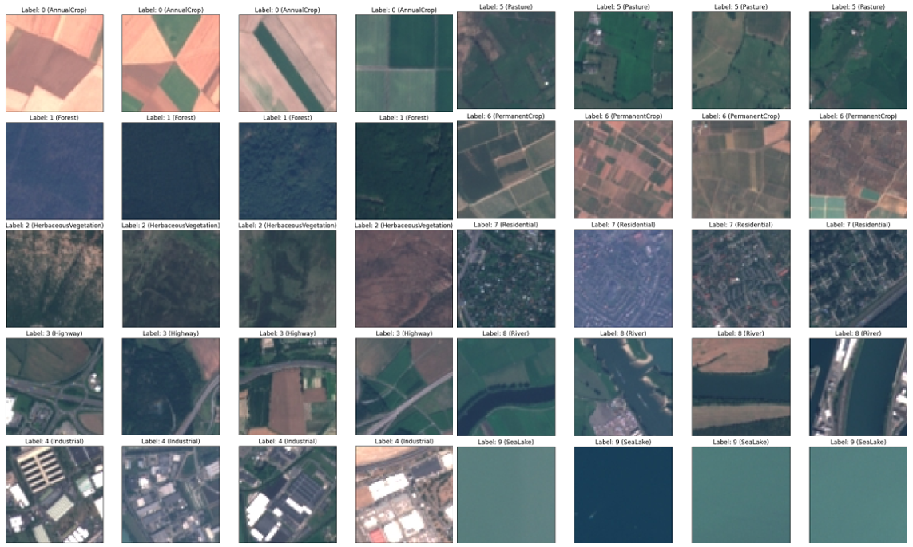
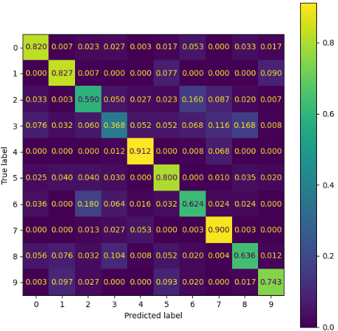

# Projeto de Visão Computacional
- Aluna: Maria Eduarda Esteves Neves

# Links de acesso:
- [Link de acesso para o Google Colab](XX)

# Descrição do Problema

- O projeto tem como finalizade desenvolver um modelo de aprendizagem de máquina cujo objetivo é realizar classificação de imagens satélite do tipo RGB.
- As imagens foram coletadas através de um [Link do Kaggle](https://www.kaggle.com/datasets/apollo2506/eurosat-dataset/data) que contém um conjunto de 27.000 imagens satélites, EuroSat Dataset,com um GSD de 10m, coletadas pelo Satélite Snetinel-2
- Descrição da base de dados:
  - Dimensoes das imagens: 64x64 pixels com canais RGB;
  - Numero de classes: 10 classes de cobertura e uso do
  solo;
  - Tamanho do conjunto de dados: 27.000 imagens:
    - Treinamento: Cerca de 19.000 imagens;
    - Validação/Teste: Cerca de 8.000 imagens.

# Descrição da Técnica escolhida para a Solução do problema

Para solucionar o problema em questão, este projeto optou por fragmentar a o desenvolvimento técnico em três partes:
1. Carregamento dos Dados: Carregados os Metadados e as Imagens
2. Pré-Processamento dos Dados
3. Modelagem do Modelo
## Carregamento dos Dados
Depois de realizado o carregamento dos dados, observou-se que as 27000 imagens eram separadas em 10 classes:
  - Classe: Pasture; Quantidade de Imagens: 2000
  - Classe: Residential; Quantidade de Imagens: 3000
  - Classe: Industrial; Quantidade de Imagens: 2500
  - Classe: SeaLake; Quantidade de Imagens: 3000
  - Classe: HerbaceousVegetation; Quantidade de Imagens: 3000
  - Classe: PermanentCrop; Quantidade de Imagens: 2500
  - Classe: Highway; Quantidade de Imagens: 2500
  - Classe: River; Quantidade de Imagens: 2500
  - Classe: Forest; Quantidade de Imagens: 3000
  - Classe: AnnualCrop; Quantidade de Imagens: 3000

Abaixo está apresentado um mosaíco com 4 exemplos para cada uma das classes.

## Pré-Processamento dos dados:
O pré-processamento dos dados foi dividido em algumas etapas:
  - Separação das imagens em conjuntos (treinamento, validação e teste) de acordo com os metadados
  - Visualização e desafios referentes aos conjuntos de imagens
  - Criação do DataSet para Pytorch
  - Criação do DataLoader para Pytorch
  - Calculo da média e desvio padrão dos pixels para os diferentes conjuntos de imagens (treinamento, validação e teste)
  - Inicialização do DataLoader com a média e desvio padrão calculados
  - Obsevação das Imagens do Dataloader
## Modelagem:
  - Criação do modelo CNN: Modelo que foi escolhido para fazer a classificação das imagens
  - Setar hiperparâmetros e variáveis relevantes
  - Criação de processos para o treinamento do modelo
  - Treinamento do modelo

# Análise Crítica dos Resultados
## Curvas de Perda X Acurácia durante o Treinamento e Validação
Através das curvas é possível concluir que os valores de acurácia tendem a crescer bem sem aparesentar overfitting. 

Uma diferença do TOP-1 para o TOP-5 é que, já nas primeiras épocas o TOP-5 tem um pico de acurária muito elevado já chegando em valores satisfatórios, sendo assim, se essa fosse a principal forma de análise não seriam necessárias tantas épocas para atingir um bom resultado

## Acurácia, Recall e Precision em Top-1 e Top-5

- Como foi comentado anteriormente, com a obtenção dos gráficos de perda e acurácia ao longo do tempo, a acurácia top-5, se levada em consideração, apresenta uma acurácia próxima de 100%, significando que, na maioria dos casos a classe verdadeira, no momento da classificação, estará entre as 5 com maiores probabilidades de acontecer.
- Apesar disso, se levada em consideração somente TOP-1 o projeto apresentou bons resultados de classificação

- Matriz de Comparativo de Métricas

| Métrica         | TOP-1 | TOP-5 |
|-----------------|-------|-------|
| Acurácia Total  | 0.73  | 0.99  | 
| Precision Total | 0.69  | 0.99  |
| Recall Total    | 0.69  | 0.99  |

## Matriz de Confusão para Análise dos resultados
A matriz de confusão será apresentada somente para o TOP-1, analisando somente aqueles casos em que o resultado que teve maior probabilidade de previsão foi equivalente ao valor TARGET real

A matriz de confusão apresenta True Label X Predicted Label.
  - Através dela é possível ver como se deu a distribuição das classificações previstas melo modelo de acordo com as diferentes classes
  - É possível ver que a classe que apresentou mais dificuldade para ser classificada foi a classe 3, sendo majoritariamente confundida com as classes 7 e 8
  - A segunda classe que apresentou uma maior dificuldade para classificação foi a classe 2, confundida majoritariamente com a classe 6 que também obteve resultados que a confundiam com a classe 2

## Visualização de previsões corretas e incorretas nos dados de teste

# Conclusão
- Pode-se concluir que o projeto apresentou bons resultados para a classificação das imagens, com uma acurácia acima de `70%`
- Para este modelo, pode-se concluir que a diferença inicial de quantidade de amostras por classe não apresentou interferência na classificação, isto pois  a classe com menor quantidade de amostras, classe 5 (2000 amostras), apresentou bons resultados quando olhamos a matriz de confusão. 
  - Entretando, pode ser que caso houvessem mais amostras o programa poderia ter trabalhado melhor em algumas classes que não apresentaram bons resultados, como no caso da classe 3 que apresentava 2500 amostras, comparando com outras que apresentavam 3000.
- Foi identificado no início do projeto que poderia haver uma confusão entre as classes 3 e 8 (Highway e River) visto que, visualmente, algumas das rodovias e dos lagos apresentavam características parecidas. Esta ideia inicial foi corroborada pela matriz de confusão
- No geral, o modelo apresentou resultados satisfatórios para a classificação de imagens. Entretando, caso o objetivo seja focar em algumas classes especificas, como por exemplo a 3, talvez seja melhor testar outra arquitetura visto que o modelo não atendeu essa classe bem. 
- Por fim, caso a ideia seja utilizar o modelo para um tipo de classificação mais geral, que considerasse o TOP-5 ele seria de ótima aplicabilidade visto que, para este tipo de análise, a acurária atingiui valores próximos de `100%`.
- O projeto foi importante principalmente para aprofundar o conhecimento no quesito de classificação de imagens e implementação de modelos manualmente, desenvolvendo mais a fundo o conhecimento de implementação de camadas e de hiperparâmetros. 

#Referências
- Adicionar um arquivo a um repositório em GitHGub: [Link](https://docs.github.com/pt/repositories/working-with-files/managing-files/adding-a-file-to-a-repository)
- Como normalizar conjunto de dados de imagem usando PyTorch [Link](https://saturncloud.io/blog/how-to-normalize-image-dataset-using-pytorch/)
- Computing Mean & STD in Image Dataset [Link](https://kozodoi.me/blog/20210308/compute-image-stats)
- Convolutional Neural Networks (CNN) with TensorFlow Tutorial [Link](https://www.datacamp.com/tutorial/cnn-tensorflow-python/)
- Download da biblioteca `EuroSat Dataset`: [Link](https://www.kaggle.com/datasets/apollo2506/eurosat-dataset/data)
- Gráficos interativos usando python plotly [Link](https://halisson-gomides.medium.com/construindo-gr%C3%A1ficos-interativos-usando-python-plotly-51d330b1ce9e)
- What is Ground Sampling Distance (GSD) Resolution? [Link](https://skyfi.com/en/blog/interpreting-daytime-resolution)
- What is top-1 and top-5 accuracy? [Link](https://www.kaggle.com/discussions/questions-and-answers/164379)
- Writing CNNs from Scratch in PyTorch [Link](https://www.digitalocean.com/community/tutorials/writing-cnns-from-scratch-in-pytorch)
- Writing Custom Datasets, DataLoaders and Transforms [Link](https://pytorch.org/tutorials/beginner/data_loading_tutorial)
- Precisão, Recall e F1 Score Em Machine Learning [Link](https://mariofilho.com/precisao-recall-e-f1-score-em-machine-learning/#o-que-%C3%A9-precis%C3%A3o)
